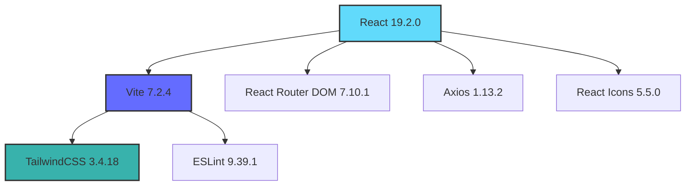

<div align="center">

# 🌾 AgriGPT Frontend

### AI-Powered Agricultural Intelligence Platform

[](https://react.dev/)
[](https://vitejs.dev/)
[](https://tailwindcss.com/)
[](LICENSE)
[](docs/CONTRIBUTING.md)

[Features](#-features) • [Demo](#-demo) • [Installation](#-installation--setup) • [Documentation](#-documentation) • [Contributing](#-contributing)

</div>

---

## 📖 Overview

**AgriGPT Frontend** is a modern, responsive web application that brings the power of artificial intelligence to agriculture. Built with React 19 and Vite, this platform provides farmers, agricultural consultants, and administrators with intelligent insights, real-time consultancy, and comprehensive management tools.

Our mission is to democratize access to agricultural knowledge through cutting-edge AI technology, making expert agricultural guidance accessible to everyone, anywhere.

### 🎯 Key Highlights

- **🤖 AI-Powered Consultancy**: Get instant, intelligent answers to agricultural questions
- **👨‍💼 Admin Dashboard**: Comprehensive management interface for administrators
- **🔐 Secure Authentication**: Role-based access control with protected routes
- **📱 Responsive Design**: Seamless experience across all devices
- **⚡ Lightning Fast**: Built with Vite for optimal performance
- **🎨 Modern UI**: Beautiful, intuitive interface with TailwindCSS

---

## ✨ Features

### For Farmers & Consultants

- **💬 Interactive Chat Interface**: Ask questions and receive AI-powered agricultural guidance
- **📊 Real-time Insights**: Get instant answers based on the latest agricultural data
- **🌐 Multi-language Support**: (Coming soon) Access in your preferred language
- **📱 Mobile-First Design**: Use on any device, anywhere

### For Administrators

- **👥 User Management**: Manage users and their access levels
- **📈 Analytics Dashboard**: Track usage and engagement metrics
- **⚙️ System Configuration**: Configure AI models and system settings
- **🔍 Audit Logs**: Monitor system activity and user interactions

### Technical Features

- **🚀 Fast Performance**: Optimized bundle size and lazy loading
- **♿ Accessibility**: WCAG 2.1 compliant for inclusive access
- **🔒 Security**: Secure authentication and data protection
- **🎨 Customizable**: Easy to theme and extend
- **📦 Modular Architecture**: Clean, maintainable codebase

---

## 🎬 Demo

> **Note**: Add screenshots, GIFs, or video demos of your application here

### Screenshots

```
Coming soon! We're preparing beautiful screenshots of the platform.
```

### Live Demo

🔗 **[Try AgriGPT Live](https://your-demo-url.vercel.app)** _(Update with your actual deployment URL)_

---

## 🏗️ Architecture / Tech Stack

### Frontend Stack



### Technology Breakdown

| Category        | Technology       | Version | Purpose                                        |
| --------------- | ---------------- | ------- | ---------------------------------------------- |
| **Framework**   | React            | 19.2.0  | UI library for building interactive interfaces |
| **Build Tool**  | Vite             | 7.2.4   | Fast development server and optimized builds   |
| **Styling**     | TailwindCSS      | 3.4.18  | Utility-first CSS framework                    |
| **Routing**     | React Router DOM | 7.10.1  | Client-side routing and navigation             |
| **HTTP Client** | Axios            | 1.13.2  | Promise-based HTTP requests                    |
| **Icons**       | React Icons      | 5.5.0   | Comprehensive icon library                     |
| **Linting**     | ESLint           | 9.39.1  | Code quality and consistency                   |
| **PostCSS**     | PostCSS          | 8.5.6   | CSS transformation and optimization            |

### Architecture Overview

```
┌────────────────────────────────────────────────────────┐
│                    User Interface                      │
│  ┌──────────────┐  ┌──────────────┐  ┌──────────────┐  │
│  │  Login Page  │  │ Consultant   │  │ Admin Panel  │  │
│  │              │  │   Interface  │  │              │  │
│  └──────────────┘  └──────────────┘  └──────────────┘  │
└────────────────────────────────────────────────────────┘
                          │
                          ▼
┌────────────────────────────────────────────────────────┐
│                  React Components                      │
│  ┌──────────────┐  ┌──────────────┐  ┌──────────────┐  │
│  │   Navbar     │  │  Protected   │  │   Context    │  │
│  │              │  │    Routes    │  │   Providers  │  │
│  └──────────────┘  └──────────────┘  └──────────────┘  │
└────────────────────────────────────────────────────────┘
                          │
                          ▼
┌────────────────────────────────────────────────────────┐
│                   Services Layer                       │
│  ┌──────────────────────────────────────────────────┐  │
│  │            Axios API Client                      │  │
│  └──────────────────────────────────────────────────┘  │
└────────────────────────────────────────────────────────┘
                          │
                          ▼
┌────────────────────────────────────────────────────────┐
│                  Backend API                           │
│              (AgriGPT Backend Service)                 │
└────────────────────────────────────────────────────────┘
```

---

## 🚀 Installation & Setup

### Prerequisites

Before you begin, ensure you have the following installed:

- **Node.js**: v18.0.0 or higher ([Download](https://nodejs.org/))
- **npm**: v9.0.0 or higher (comes with Node.js)
- **Git**: Latest version ([Download](https://git-scm.com/))

### Quick Start

1. **Clone the Repository**

   ```bash
   git clone https://github.com/alumnx-ai-labs/agrigpt-frontend.git
   cd agrigpt-frontend
   ```

2. **Install Dependencies**

   ```bash
   npm install
   ```

3. **Set Up Environment Variables**

   ```bash
   cp .env.example .env
   ```

   Edit `.env` and configure your environment variables (see [Environment Variables](#-environment-variables) section).

4. **Start Development Server**

   ```bash
   npm run dev
   ```

5. **Open in Browser**

   Navigate to [http://localhost:5173](http://localhost:5173)

### Production Build

To create a production-ready build:

```bash
npm run build
```

To preview the production build locally:

```bash
npm run preview
```

### Deployment

This project is configured for easy deployment on **Vercel**:

[](https://vercel.com/new/clone?repository-url=https://github.com/alumnx-ai-labs/agrigpt-frontend)

Or deploy manually:

```bash
# Install Vercel CLI
npm install -g vercel

# Deploy
vercel
```

---

## 🔐 Environment Variables

Create a `.env` file in the root directory with the following variables:

### Development Environment

```env
# API Configuration
VITE_API_BASE_URL=http://localhost:8000

# Optional: Environment identifier
VITE_ENVIRONMENT=development
```

### Production Environment

```env
# API Configuration
VITE_API_BASE_URL=https://api.yourdomain.com

# Environment identifier
VITE_ENVIRONMENT=production

# Optional: Analytics
VITE_ANALYTICS_ID=your_analytics_id
```

### Environment Variable Reference

| Variable            | Description                                     | Required | Default       |
| ------------------- | ----------------------------------------------- | -------- | ------------- |
| `VITE_API_BASE_URL` | Backend API endpoint URL                        | Yes      | -             |
| `VITE_ENVIRONMENT`  | Environment identifier (development/production) | No       | `development` |
| `VITE_ANALYTICS_ID` | Analytics tracking ID                           | No       | -             |

> **⚠️ Important**: Never commit your `.env` file to version control. Use `.env.example` as a template.

---

## 📚 Usage

### Running the Application

```bash
# Development mode with hot reload
npm run dev

# Production build
npm run build

# Preview production build
npm run preview

# Lint code
npm run lint
```

### Available Scripts

| Script            | Description                           |
| ----------------- | ------------------------------------- |
| `npm run dev`     | Start development server on port 5173 |
| `npm run build`   | Create optimized production build     |
| `npm run preview` | Preview production build locally      |
| `npm run lint`    | Run ESLint to check code quality      |

### User Roles & Access

#### Consultant Role

- Access to AI-powered chat interface
- View agricultural insights and recommendations
- Save conversation history

#### Admin Role

- Full access to admin dashboard
- User management capabilities
- System configuration and monitoring
- Analytics and reporting

### API Integration

The application communicates with the backend API through the Axios client configured in `src/services/api.js`:

```javascript
import api from "./services/api";

// Example: Fetch data
const response = await api.get("/endpoint");

// Example: Post data
const result = await api.post("/endpoint", data);
```

---

## 🤝 Contributing

We welcome contributions from the community! Whether you're fixing bugs, adding features, or improving documentation, your help is appreciated.

### How to Contribute

1. **Read the Contributing Guide**: Check out our [CONTRIBUTING.md](docs/CONTRIBUTING.md) for detailed guidelines
2. **Fork the Repository**: Click the "Fork" button on GitHub
3. **Create a Branch**: `git checkout -b feature/your-feature-name`
4. **Make Changes**: Follow our coding standards and best practices
5. **Test Thoroughly**: Ensure your changes work as expected
6. **Submit a Pull Request**: Open a PR with a clear description

### Development Guidelines

- Follow the [Code of Conduct](docs/CONTRIBUTING.md#-code-of-conduct)
- Write clean, maintainable code
- Add comments for complex logic
- Test your changes thoroughly
- Update documentation as needed

### Good First Issues

Looking for a place to start? Check out issues labeled [`good first issue`](https://github.com/alumnx-ai-labs/agrigpt-frontend/labels/good%20first%20issue).

---

## 📂 Project Structure

```
agrigpt-frontend/
├── 📄 .env                      # Environment variables (not in git)
├── 📄 .env.example              # Environment template
├── 📄 .env.production.example   # Production environment template
├── 📄 .gitignore                # Git ignore rules
├── 📄 README.md                 # This file
├── 📄 package.json              # Dependencies and scripts
├── 📄 vite.config.js            # Vite configuration
├── 📄 tailwind.config.js        # Tailwind CSS configuration
├── 📄 eslint.config.js          # ESLint configuration
├── 📄 postcss.config.js         # PostCSS configuration
├── 📄 vercel.json               # Vercel deployment config
├── 📄 index.html                # HTML entry point
│
├── 📁 docs/                     # Documentation
│   └── 📄 CONTRIBUTING.md       # Contribution guidelines
│
├── 📁 public/                   # Static assets
│   └── 🖼️ vite.svg              # Vite logo
│
└── 📁 src/                      # Source code
    ├── 📄 main.jsx              # Application entry point
    ├── 📄 App.jsx               # Main App component
    ├── 📄 App.css               # App-level styles
    ├── 📄 index.css             # Global styles + Tailwind
    │
    ├── 📁 assets/               # Images, fonts, etc.
    │   └── 🖼️ react.svg         # React logo
    │
    ├── 📁 components/           # Reusable components
    │   ├── 📄 Navbar.jsx        # Navigation bar
    │   └── 📄 ProtectedRoute.jsx # Route protection
    │
    ├── 📁 context/              # React Context
    │   └── 📄 AuthContext.jsx   # Authentication context
    │
    ├── 📁 pages/                # Page components
    │   ├── 📄 LoginPage.jsx     # Login page
    │   ├── 📄 ConsultantPage.jsx # Consultant interface
    │   └── 📄 AdminPage.jsx     # Admin dashboard
    │
    └── 📁 services/             # API & utilities
        └── 📄 api.js            # Axios API client
```

### Key Directories

- **`src/components/`**: Reusable UI components
- **`src/pages/`**: Top-level page components for routes
- **`src/context/`**: Global state management with Context API
- **`src/services/`**: API integration and utilities
- **`docs/`**: Project documentation

---

## 🗺️ Roadmap

### ✅ Completed

- [x] Core application setup with React + Vite
- [x] Authentication system with protected routes
- [x] Admin dashboard interface
- [x] Consultant chat interface
- [x] Responsive design with TailwindCSS
- [x] API integration with Axios
- [x] Deployment configuration for Vercel

### 🚧 In Progress

- [ ] Enhanced AI chat features
- [ ] User profile management
- [ ] Conversation history
- [ ] Advanced analytics dashboard

### 🔮 Future Plans

#### Q1 2025

- [ ] **Multi-language Support**: Add internationalization (i18n)
- [ ] **Dark Mode**: Implement theme switching
- [ ] **Offline Support**: Progressive Web App (PWA) capabilities
- [ ] **Voice Input**: Voice-to-text for queries

#### Q2 2025

- [ ] **Mobile App**: React Native version
- [ ] **Advanced Analytics**: Detailed usage insights
- [ ] **Export Features**: Download conversations and reports
- [ ] **Notifications**: Real-time alerts and updates

#### Q3 2025

- [ ] **Collaborative Features**: Multi-user consultations
- [ ] **Integration Hub**: Connect with third-party agricultural tools
- [ ] **AI Model Selection**: Choose different AI models
- [ ] **Custom Workflows**: Create automated agricultural workflows

#### Long-term Vision

- [ ] **Marketplace**: Platform for agricultural products and services
- [ ] **Community Forum**: Connect farmers and experts
- [ ] **IoT Integration**: Connect with smart farming devices
- [ ] **Blockchain**: Transparent supply chain tracking

### 💡 Feature Requests

Have an idea? [Open a feature request](https://github.com/alumnx-ai-labs/agrigpt-frontend/issues/new?template=feature_request.md) or contribute directly!

---

## 📄 License

This project is licensed under the **MIT License** - see the [LICENSE](LICENSE) file for details.

### MIT License Summary

```
MIT License

Copyright (c) 2025 AlumnX AI Labs

Permission is hereby granted, free of charge, to any person obtaining a copy
of this software and associated documentation files (the "Software"), to deal
in the Software without restriction, including without limitation the rights
to use, copy, modify, merge, publish, distribute, sublicense, and/or sell
copies of the Software, and to permit persons to whom the Software is
furnished to do so, subject to the following conditions:

The above copyright notice and this permission notice shall be included in all
copies or substantial portions of the Software.

THE SOFTWARE IS PROVIDED "AS IS", WITHOUT WARRANTY OF ANY KIND, EXPRESS OR
IMPLIED, INCLUDING BUT NOT LIMITED TO THE WARRANTIES OF MERCHANTABILITY,
FITNESS FOR A PARTICULAR PURPOSE AND NONINFRINGEMENT.
```

---

## 👨‍💻 Maintainers

This project is maintained by the **AlumnX AI Labs** team:

<table>
  <tr>
    <td align="center">
      <a href="https://github.com/vijender883">
        
        <br />
        <sub><b>Vijender .P</b></sub>
      </a>
      <br />
      <sub>Project Lead</sub>
    </td>
    <td align="center">
      <a href="https://github.com/vamshi4352">
        
        <br />
        <sub><b>Vamshi Vardhan .K</b></sub>
      </a>
      <br />
      <sub>Core Developer</sub>
    </td>
  </tr>
</table>

<!-- > **Note**: Update the maintainers section with actual GitHub usernames and roles -->

### Contact

- **GitHub Issues**: [Report bugs or request features](https://github.com/alumnx-ai-labs/agrigpt-frontend/issues)
- **Email**: contact@alumnx-ai-labs.com _(Update with actual email)_
- **Twitter**: [@AgriGPT](https://twitter.com/agrigpt) _(Update with actual handle)_

---

## 🙏 Acknowledgments

- **React Team**: For the amazing React library
- **Vite Team**: For the blazing-fast build tool
- **TailwindCSS**: For the excellent utility-first CSS framework
- **Open Source Community**: For inspiration and contributions

---

## 📊 Project Stats


---

<div align="center">

### ⭐ Star us on GitHub — it motivates us a lot!

Made with ❤️ by [AlumnX AI Labs](https://github.com/alumnx-ai-labs)

[⬆ Back to Top](#-agrigpt-frontend)

</div>
